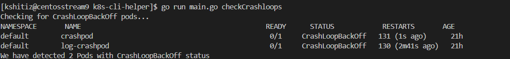
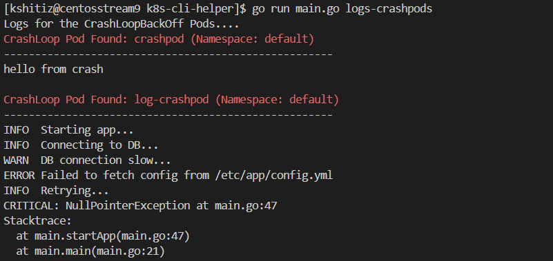
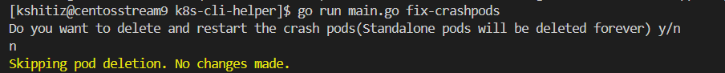
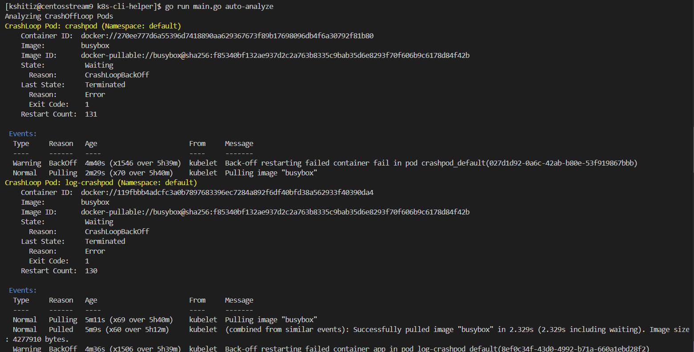
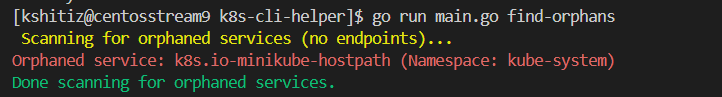
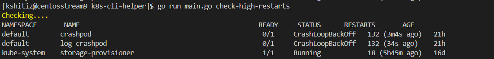
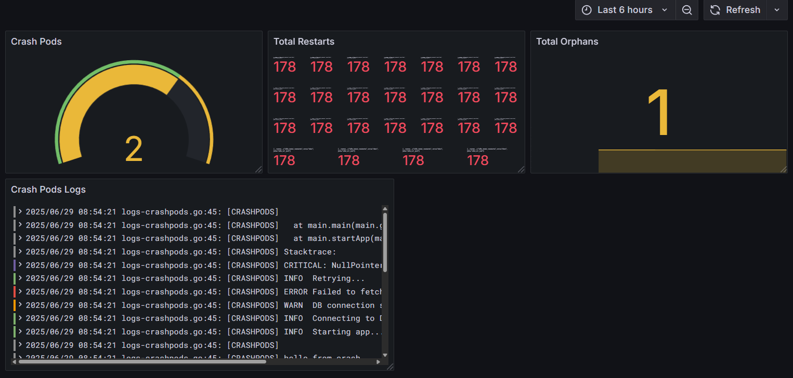

# k8s-cli-helper
A Go-based CLI tool to detect and debug Kubernetes CrashLoopBackOff pods and orphaned workloads.

## Table of Contents
- Features
- Commands
- Monitoring Setup
- Technologies Used
- Screenshots
- How to Test
- Author

## Features
- Detect `CrashLoopBackOff` pods
- Show crash logs 
- Describes only necessary info of `CrashLoopBackOff` pods
- Restarts `CrashLoopBackOff` pods
- Detects pods with high restart counts
- Identify `orphan` pods not owned by Deployments
- Integrate with Prometheus + Grafana + Loki
- Send email alerts using Alertmanager

##  Commands

- go run main.go checkCrashloops
- go run main.go logs-crashpods
- go run main.go fix-crashpods
- go run main.go auto-analyze
- go run main.go check-high-restarts
- go run main.go find-orphans

## Test It

- kubectl apply -f sample-pods/crashpod.yaml
- go run main.go checkCrashloops

## Monitoring Stack

This repo includes optional Prometheus, Grafana, and Loki setup.  
See `monitoring/setup.md` for instructions.

## Screenshots

##  Screenshots

###  CLI Commands Output

####  CrashLoopBackOff Detection

####  Logs of Crashing Pods

####  Suggested Fixes

#### Important Pod Info

#### Orphan Pod Detection

#### High-Restart Pod Detection

---

###  Grafana Dashboard

####  Monitoring Pod Metrics and Alerts

